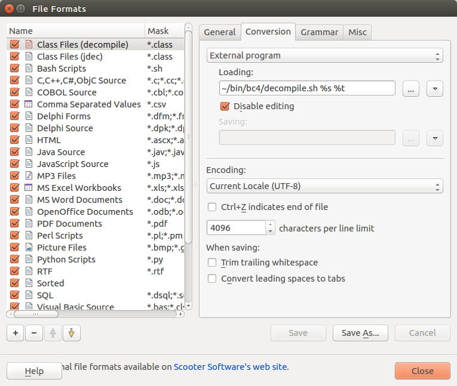

# jd-core-cli

A simple command-line Java class decompiler using [jd-core](https://github.com/java-decompiler/jd-core) library

## Purpose

The main purpose of this program is to be used in [Beyond Compare 4](https://www.scootersoftware.com/) to compare two class files in decompiled source form on-the-fly.

## How to use in Beyond Compare 4

### Compile & Generate a jar file

```
$ ./gradlew jar
```

`jd-core-cli.jar` file will be created in `build/libs/` directory.
Copy this jar file into your favorite place (ex. $HOME/bin).

### Make a shell script to decompile a given class file

Prepare the following shell script which will be invoked from Beyond Compare 4.

```
$ cat ~/bin/bc4/decompile.sh
#!/bin/bash
JAVA_HOME=/opt/jdk-11.0.6
DECOMPILER_JAR=$HOME/bin/jd-core-cli.jar
$JAVA_HOME/bin/java -jar ${DECOMPILER_JAR} $1 $2
```

The environment variables, `$JAVA_HOME` and `$DECOMPILER_JAR`, should be replaced with your corresponding values.

### Configure Beyond Compare 4 setting

Add a new file format for Java class files (\*.class) and configure the `External program` setting as the following.



Now you can compare two Java class files in the source form.
